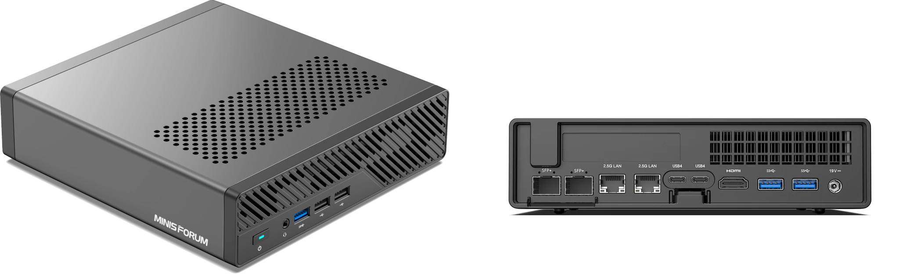
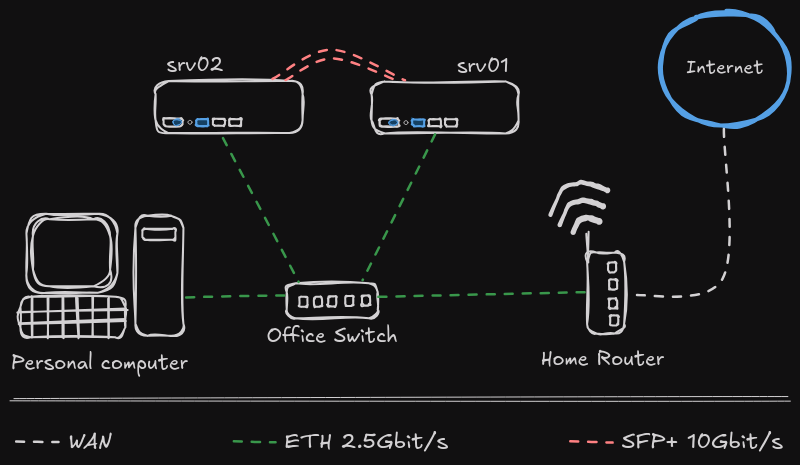

# Homelab

**Version**:        0.1 \
**Creation date**:  08/02/2025 \
**Last update**:    09/02/2025

## Introduction

The purpose of this repository is to document my homelab.

## Hardware

For the moment, my homelab is very basic.
It consists of two servers connected to my home network.

My 2 servers are identical.
They are [Miniforum MS-01](https://store.minisforum.com/products/minisforum-ms-01)
and have the following specs:

| Part       | Number | Description                                    |
| ---------- | ------ | ---------------------------------------------- |
| Model      | 2x     | MiniWorkStation MS-01                          |
| CPU        | 1x     | Intel® Core™ i9-13900H                         |
| Graphics   | 1x     | Intel® Iris® Xe Graphics eligible              |
| RAM        | 2x     | SO-DIMM 5200MHz 32 Go                          |
| Slot SSD 1 | 1x     | M.2 2280 NVMe SSD slot (Alt U.2) (PCIe 4.0 x4) |
| SSD 1      | 1x     | Samsung 990 Pro 2 To                           |
| Slot SSD 2 | 1x     | M.2 2280/22110 NVMe SSD slot (PCIe 3.0 x4)     |
| Slot SSD 3 | 1x     | M.2 2280/22110 NVMe SSD slot (PCIe 3.0 x2)     |
| SSD 2 / 3  | 2x     | Samsung 970 EVO Plus 500 Go                    |
| Network 1  | 2x     | 2.5Gbps RJ45                                   |
| Network 2  | 2x     | 10Gbps SFP+                                    |

## Network

My network is currently very simple.
The two servers are connected directly to my office switch.
They are therefore connected directly to my home network.

I also use the 2 SFP+ ports on each server to link them directly together
without going through a switch.
This allows me to pass through heavy data traffic such as distributed storage
and hot migrations.

### Network Diagram

### IP Plan

#### HomeNet

My home network, which also serves as the management network for my lab and
the network for my VMs.

| Netmask | CIDR Base IP | Brodcast IP   | First Usable IP | Last Usable IP |
| ------- | ------------ | ------------- | --------------- | -------------- |
| /24     | 192.168.1.0  | 192.168.1.255 | 192.168.1.1     | 192.168.1.254  |

| Device | Interface |  IP Address   | Subnet Mask   |
| ------ | --------- | ------------- | ------------- |
| Router | eth0      | 192.168.1.1   | 255.255.255.0 |
| esx01  | eth0      | 192.168.1.10  | 255.255.255.0 |
| esx02  | eth0      | 192.168.1.11  | 255.255.255.0 |
| vcs01  | virtual   | 192.168.1.20  | 255.255.255.0 |
| nas01  | virtual   | 192.168.1.50  | 255.255.255.0 |

**DHCP Range**: 192.168.1.200 - 192.168.1.250

#### ClusterNet

This network is dedicated to cluster traffic (VMotion, etc.).
There are only the 2 servers in this network and they are directly
connected to each other.

| Netmask | CIDR Base IP | Brodcast IP  | First Usable IP | Last Usable IP |
| ------- | ------------ | ------------ | --------------- | -------------- |
| /30     | 192.168.20.0 | 192.168.20.3 | 192.168.20.1    | 192.168.20.2   |

| Device | Interface | IP Address   | Subnet Mask     |
| ------ | --------- | ------------ | --------------- |
| esx01  | sfp0      | 192.168.20.1 | 255.255.255.252 |
| esx02  | sfp0      | 192.168.20.2 | 255.255.255.252 |

#### StorageNet

This network is dedicated to the distributed storage of my cluster.
Physically, these are my 2 servers connected via a dedicated SFP+ interface
which are brought together in a network.
The virtual NAS is also part of this network.

| Netmask | CIDR Base IP | Brodcast IP   | First Usable IP | Last Usable IP |
| ------- | ------------ | ------------- | --------------- | -------------- |
| /28     | 192.168.50.0 | 192.168.50.15 | 192.168.50.1    | 192.168.50.14  |

| Device | Interface | IP Address    | Subnet Mask     |
| ------ | --------- | ------------- | --------------- |
| esx01  | sfp1      | 192.168.50.1  | 255.255.255.240 |
| esx02  | sfp1      | 192.168.50.2  | 255.255.255.240 |
| nas01  | virtual   | 192.168.50.14 | 255.255.255.240 |
