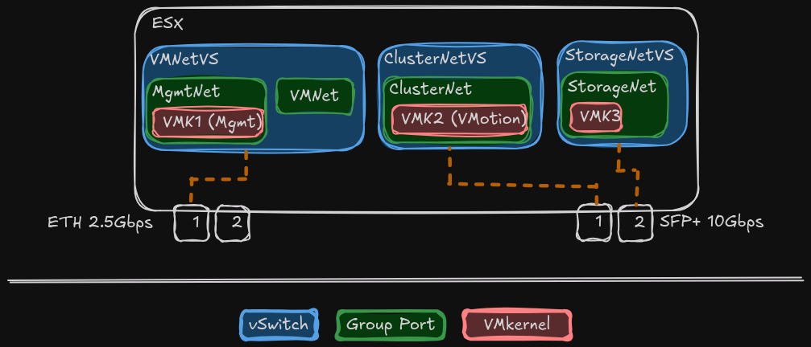
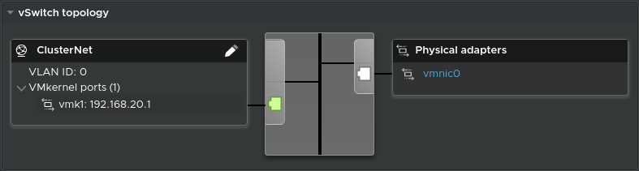
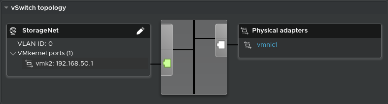
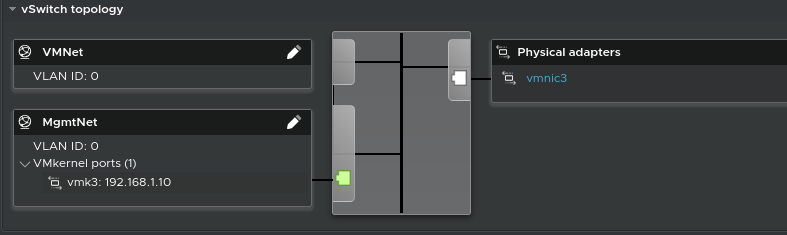

# Setup ESX

## Licence

I start by activating the licence for my ESX.
For more [information about licences](https://gist.github.com/ayebrian/646775424393c9a35fb8257f44df1c8b).

1. Go to `Host -> Manage -> Licensing` and click on `Assign License`.
2. License key: `<license_key_form_the_magic_gh_repo>`.
3. Click on `Check License` and then on `Assign License`.

## Setup NTP

We need the ESXs to be on time, so we need to configure NTP.

1. Go to `Host -> Manage -> Time & Date` and click on `Edit NTP Settings`.
2. Check `Use Network Time Protocol (Enable NTP client)`.
3. NTP service startup policy: `Start and stop with host`.
4. NTP Servers: `0.ch.pool.ntp.org,1.ch.pool.ntp.org,2.ch.pool.ntp.org,3.ch.pool.ntp.org`.
5. Save.

> **Note**: Here, I choose swiss NTP servers to limit ping with my lab.
Any public NTP works.

### Start NTP service

We have configured our NTP client to start the service at the same time as the host.
But for the moment, it hasn't been started.

1. Go to `Host -> Manage -> Services`.
2. Click on `ntpd` and then on `Start`.

If the client configuration is correct, the ntpd service is listed as Running.

## Setup SSH

This should not be done in production as it adds an attack surface.
But as I'm in a lab, I'm going to enable SSH permanently on the ESXs.

1. Go to `Host -> Manage -> Services`.
2. Select `TSM-SSH`, click on `Actions -> Policy -> Start and stop with host`.

### Start SSH service

As for NTP, we have to start the service manually for the first time.

1. Go to `Host -> Manage -> Services`.
2. Click on `TSM-SSH` and then on `Start`.

## Setup Storage

As I have 2 mobile SSDs in each of my servers, I'm going to create
2 datastores on each.
I'm creating two datastores per server because I have a fast 2TB SSD and
a slower 500GB SSD on each.

The fast datastore is call `HS-DS-<host_number>`.
`HS` for high-speed and `DS` for datastore.
The slower datastore is call `LS-DS-<host_number>`.
`LS` for low-speed and `DS` for datastore.

### Create High-Speed Datastore

1. Go to `Storage -> Datastores` and click `New datastore`.
2. Select `Create a new datastore` and click `Next`.
3. Name: `HS-DS-<host_number>`.
4. Select the device: `NVMe SSD 990 EVO 2TB`.
5. Select `Use full disk` and `VMFS 6` then click `Next`.
6. Click `Finish`.

### Create Low-Speed Datastore

1. Go to `Storage -> Datastores` and click `New datastore`.
2. Select `Create a new datastore` and click `Next`.
3. Name: `LS-DS-<host_number>`.
4. Select the device: `NVMe SSD 970 EVO Plus 500GB`.
5. Select `Use full disk` and `VMFS 6` then click `Next`.
6. Click `Finish`.

## Setup Networking

Here's how I'm going to configure the network on my ESXs.
I'm only using one of the 2 ethernet ports because I only have 2 ports
available on my office switch (1 for each server).

### Setup ClusterNet

I start by creating a new vSwitch.

1. Go to `Networking -> Virtual Switches` and click `Add standard virtual switch`.
2. vSwitch Name: `ClusterNetVS`.
3. MTU: `1500`.
4. Uplink 1: `vmnic0`.
5. Click `Add`.

Now that we have our vSwitch, we can add the Port Group.

1. Go to `Networking -> Port groups` and click `Add port group`.
2. Name: `ClusterNet`.
3. VLAND ID: `0`.
4. Virtual switch: `ClusterNetVS`.
5. Click `Add`.

Finally, we can add our VMkernel for VMotion.

1. Go to `Networking -> VMkernel NICs` and click `Add VMkernel NIC`.
2. Port group: `ClusterNet`.
3. MTU: `1500`.
4. IP version: `IPv4 only`.
5. IPv4 settings: `Static`.
6. Address: `192.168.20.1` or `192.168.20.2` (it depends on the host).
7. Subnet mask: `255.255.255.252`
8. TCP/IP stack: `VMotion stack`.
9. Click `Create`.

### Setup StorageNet

Create a new vSwitch.

1. Go to `Networking -> Virtual Switches` and click `Add standard virtual switch`.
2. vSwitch Name: `StorageNetVS`.
3. MTU: `1500`.
4. Uplink 1: `vmnic1`.
5. Click `Add`.

Create the port group.

1. Go to `Networking -> Port groups` and click `Add port group`.
2. Name: `StorageNet`.
3. VLAND ID: `0`.
4. Virtual switch: `StorageNetVS`.
5. Click `Add`.

We can now add our VMkernel for iSCSI.

1. Go to `Networking -> VMkernel NICs` and click `Add VMkernel NIC`.
2. Port group: `StorageNet`.
3. MTU: `1500`.
4. IP version: `IPv4 only`.
5. IPv4 settings: `Static`.
6. Address: `192.168.50.1` or `192.168.50.2` (it depends on the host).
7. Subnet mask: `255.255.255.240`.
8. TCP/IP stack: `Default TCP/IP stack`.
9. Click `Create`.

### Setup VMNet

> **Note**: It is not possible to rename a vSwitch and ESX creates a
vSwitch named vSwitch0.
My aim is to delete it and reconfigure a new call VMNetVS. \
To do this, I'll have to change the IP address of the management
VMkernel which has been created by default (and on which I'm connected). \
Because I want to recover it to reuse it for my new management VMKernel
which will be in the new VMNetVS vSwitch.

Change the default management VMKernel IP.

1. Go to `Networking -> VMkernel NICs` and click on the `Management Network` VMKernel.
2. Click on `Edit settings`.
3. Change the IP address to `192.168.1.42`.
4. Click `Save`.

> **Note**: When we save the configuration, we lose the connection.
This is normal, we have just changed the IP address of the VMKernel
on which we are connected to configure our ESX. \
We need to connect with our browser to the new IP address we have just configured.

Create a new vSwitch.

1. Go to `Networking -> Virtual Switches` and click `Add standard virtual switch`.
2. vSwitch Name: `VMNetVS`.
3. MTU: `1500`.
4. Uplink 1: `vmnic3`.
5. Click `Add`.

Create the port group for the VMs.

1. Go to `Networking -> Port groups` and click `Add port group`.
2. Name: `VMNet`.
3. VLAND ID: `0`.
4. Virtual switch: `VMNetVS`.
5. Click `Add`.

Create the port group for the management.

1. Go to `Networking -> Port groups` and click `Add port group`.
2. Name: `MgmtNet`.
3. VLAND ID: `0`.
4. Virtual switch: `VMNetVS`.
5. Click `Add`.

We can now add our VMkernel for the management.

1. Go to `Networking -> VMkernel NICs` and click `Add VMkernel NIC`.
2. Port group: `MgmtNet`.
3. MTU: `1500`.
4. IP version: `IPv4 only`.
5. IPv4 settings: `Static`.
6. Address: `192.168.1.10` or `192.168.1.11` (it depends on the host).
7. Subnet mask: `255.255.255.0`.
8. TCP/IP stack: `Default TCP/IP stack`.
9. Services: `Management`.
10. Click `Create`.

Now that I've configured my new vSwitch with the new management interface and
the correct IP address, all I need to do is change the port on my ethernet cable.
I'll be able to connect again with the correct IP address via my browser.

### Clean default Network configuration

I'll start by deleting the default VMkernel

1. Go to `Networking -> VMkernel NICs` and click on the `Management Network` VMKernel.
2. Click on `Actions -> Remove`.

Then I'll delete the port group `VM Network`.

1. Go to `Networking -> Port groups` and click on the `VM Network` port group.
2. Click on `Actions -> Remove`.

Delete the `Management Network` port group.

1. Go to `Networking -> Port groups` and click on the `Management Network` port group.
2. Click on `Actions -> Remove`.

Finally, I'll delete the default vSwitch `vSwitch0`.

1. Go to `Networking -> Virtual Switches` and click on the `vSwitch0` vSwitch.
2. Click on `Actions -> Remove`.
